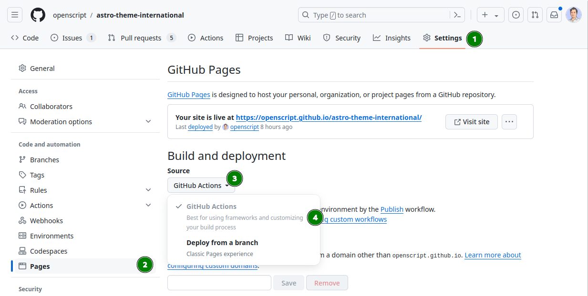

# `astro-theme-international`

An Astro theme, focused on internationalization.

## Usage

🛠️ How to use this theme?

1. Use this repository as a template.
1. Enable Github Pages in the repository settings:   
1. Open the repository with Visual Studio Code.
1. Make sure you have Docker and the Dev Containers extension installed.
1. Open the repository in a Dev Container.
1. Start making your changes.

🎁 How to contribute to this theme?

1. Fork the project.
1. Add your changes.
1. Open a pull request.

## Features

- Internationalization
  - UI translations
  - Content translations
  - Route translations
  - Language switcher
  - `hreflang` and others meta tags
- Automated testing
  - Unit and integration tests using [vitest](https://vitest.dev/)
  - Coverage reports 
- Opinionated pre-configured developer setup
  - [Visual Studio Code Dev Containers](https://code.visualstudio.com/docs/remote/containers)
  - Type-safe development with [Typescript](https://www.typescriptlang.org/)
  - Pre-configured [Github Actions](https://github.com/features/actions) for CI/CD
  - Compatible with [Github Pages](https://pages.github.com/)
  - Works on a subpath (e.g. `http://example.com/my-cool-astro-site/`)
  - MDX support [(@astrojs/mdx)](https://docs.astro.build/en/guides/mdx/)
  - Interactive components with [Preact](https://preactjs.com/)
  - Release cycle including generating changelogs with [changesets](https://github.com/changesets/changesets)
- Connectivity
  - RSS Feeds with i18n support [(@astrojs/rss)](https://docs.astro.build/en/guides/rss/)
  - Sitemaps with i18n support [(@astrojs/sitemap)](https://docs.astro.build/en/guides/integrations-guide/sitemap/)
  - Static search using [Pagefind](https://pagefind.app/)
- Userfacing features
  - Dark mode
  - Pagination
  - 404 page
  - Favicons
  - Custom fonts
  - Responsivness
  - Markdown
    - Autolink headings
    - Table of Contents generation

### Content types

- Page (`pages`): A simple page with a title and content.
- Post (`blog`): A blog post with a title, content, and date.

### Layouts

- DefaultLayout: Layout with a header, main and footer.

### Sections

## Resources

- Fonts: https://fontsource.org/
- Colors: https://colorhunt.co/palette/f8ededff8225b43f3f173b45
- Icons: https://tabler.io/icons
- Backgrounds: https://www.fffuel.co/
- Favicon Generator: https://realfavicongenerator.net/
- Data Protection: https://gdpr.eu/privacy-notice/

### Articles

- https://dominuskelvin.dev/blog/understanding-astro-components
- https://simonhearne.com/2021/layout-shifts-webfonts/
- https://github.com/remarkjs/remark/blob/main/doc/plugins.md
- https://github.com/rehypejs/rehype/blob/main/doc/plugins.md
